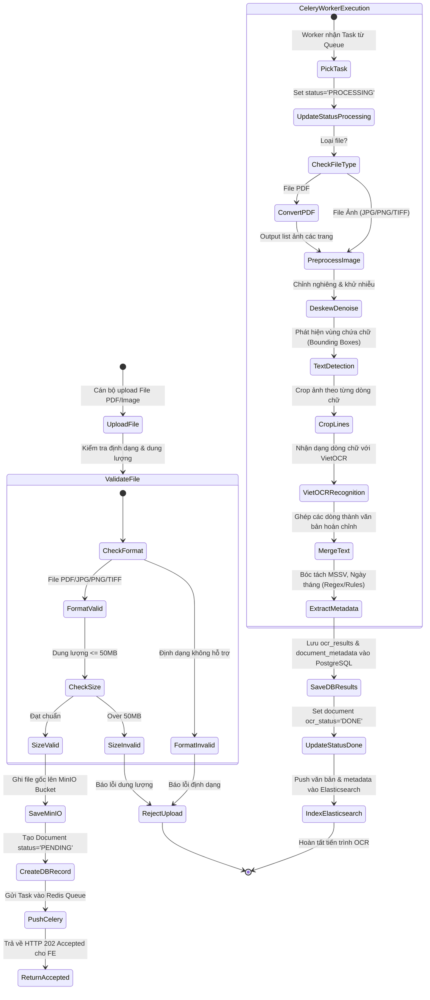
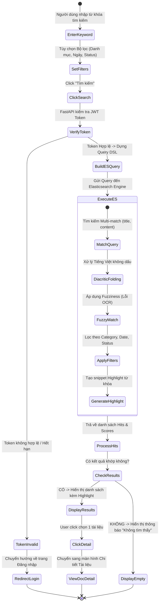

# Activity Diagram — Sơ đồ Hoạt động

## Purpose

Mô tả luồng điều khiển và luồng xử lý dữ liệu (Control & Data Flow) của các tiến trình chính trong hệ thống Student-Document-OCR.

## Scope

2 Activity Diagrams: Tiến trình Xử lý OCR Async & Tiến trình Tìm kiếm & Tra cứu Văn bản.

---

## 1. Activity Diagram 1: Tiến trình Xử lý OCR Async (OCR Processing Pipeline)

---

## 2. Activity Diagram 2: Tiến trình Tìm kiếm & Lọc Tài liệu (Search & Filtering)

---

## TODO

- [ ] Chuyển đổi sơ đồ sang dạng PlantUML nếu cần vẽ bản in chính thức.
- [ ] Bổ sung sơ đồ Activity cho quy trình Chỉnh sửa OCR và Quản lý User.

## References

- Architecture.md
- UseCase.md
- SequenceDiagram.md
