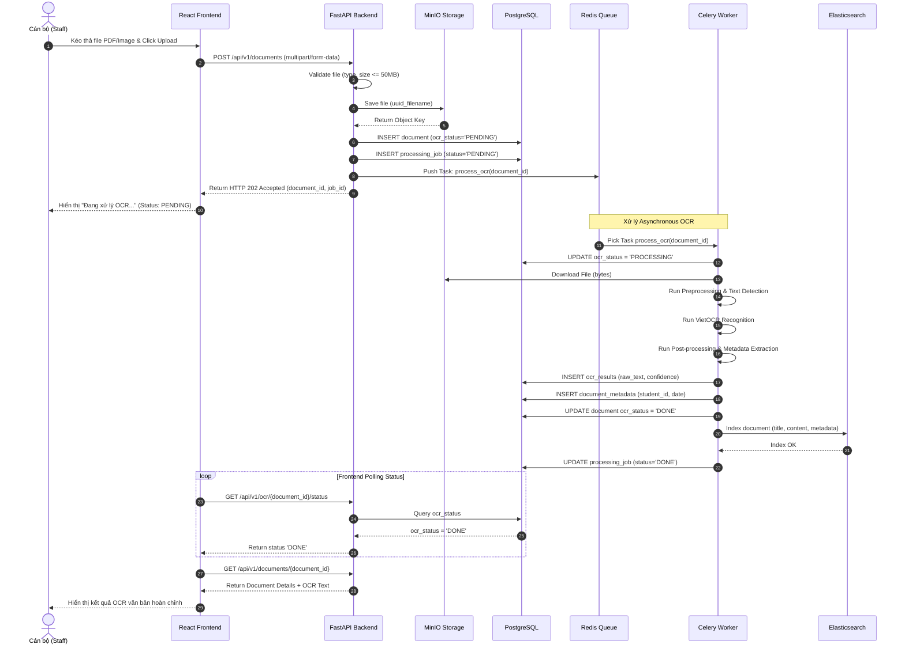
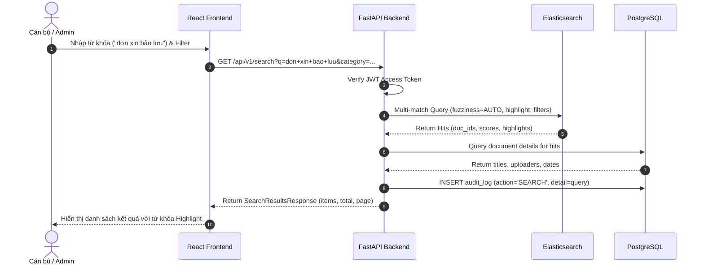
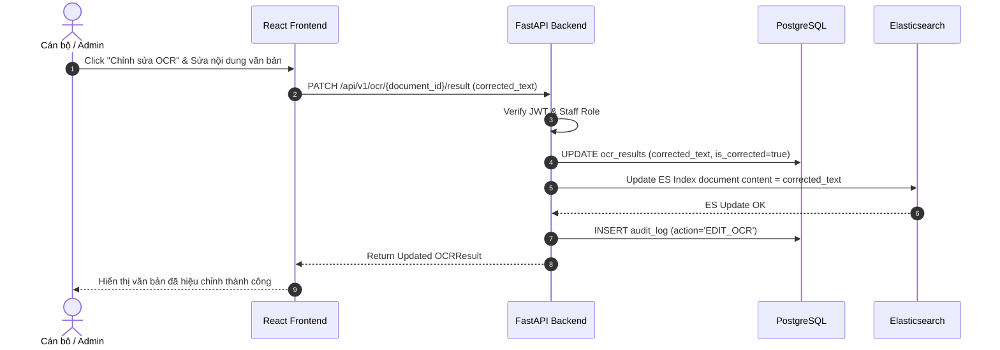

# Sequence Diagram — Sơ đồ Tuần tự Hệ thống

## Purpose

Mô tả luồng tương tác giữa các thành phần phần mềm (Actor, React Frontend, FastAPI Backend, Celery Worker, Database, MinIO, Elasticsearch) theo thời gian cho các kịch bản quan trọng.

## Scope

3 Sequence Diagrams chính: Upload & Async OCR Flow, Search Document Flow, Human Correction OCR Flow.

---

## 1. Sequence Diagram 1: Upload Tài liệu & Async OCR Pipeline

---

## 2. Sequence Diagram 2: Tìm kiếm Văn bản (Full-text Search)

---

## 3. Sequence Diagram 3: Hiệu chỉnh OCR Thủ công (Human Correction)

---

## TODO

- [ ] Bổ sung Sequence Diagram cho luồng Đăng nhập (Auth Flow) và Xóa tài liệu.
- [ ] Export các sơ đồ ra định dạng PNG/SVG nhúng vào báo cáo đồ án.

## References

- Architecture.md
- API.md
- UseCase.md
