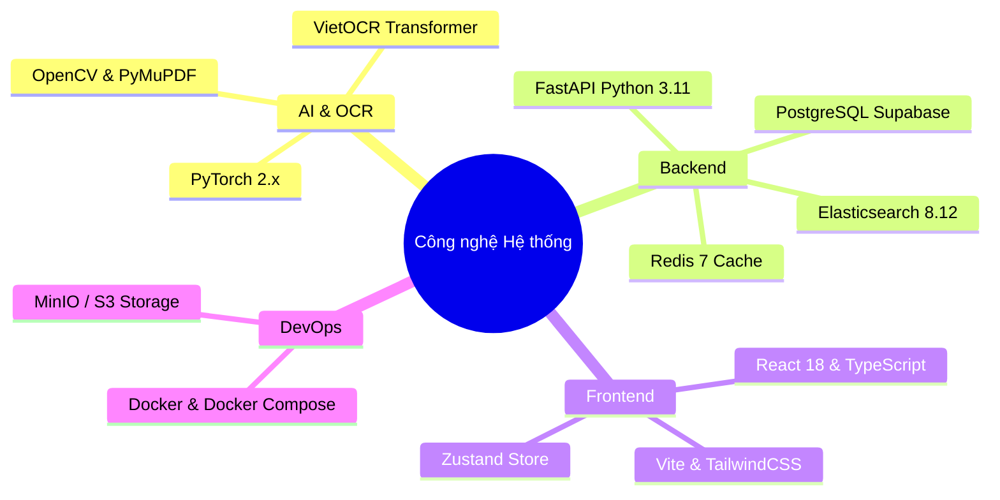
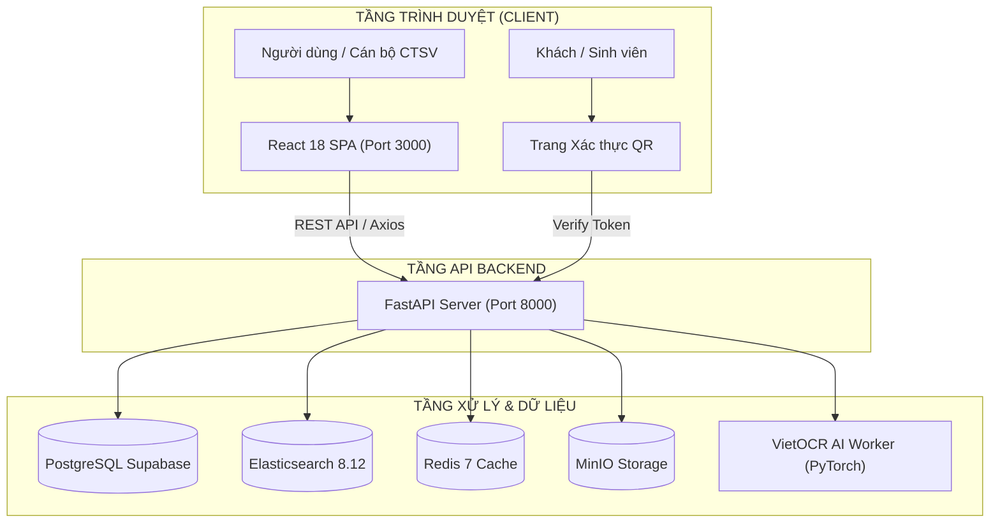
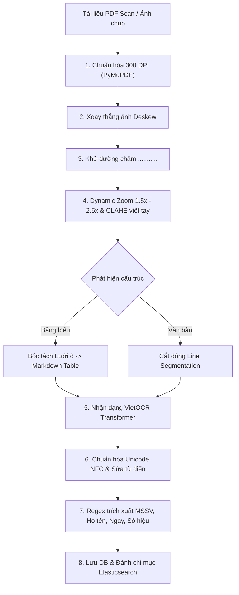
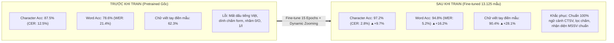
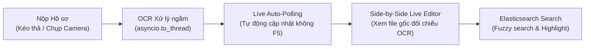

# NỘI DUNG SLIDE POWERPOINT BÁO CÁO ĐỒ ÁN TỐT NGHIỆP
**ĐỀ TÀI: XÂY DỰNG HỆ THỐNG SỐ HÓA VÀ TRÍCH XUẤT THÔNG TIN TÀI LIỆU CÔNG TÁC SINH VIÊN BẰNG MÔ HÌNH OCR VÀ TÌM KIẾM TOÀN VĂN**

---

### SLIDE 1: TRANG TIÊU ĐỀ
* **Trường**: ĐẠI HỌC ĐÀ LẠT – KHOA CÔNG NGHỆ THÔNG TIN
* **Đề tài**: **Hệ thống Số hóa và Trích xuất Thông tin Tài liệu CTSV (DocuCTSV)**
* **GVHD**: ThS. / TS. [Tên Giảng Viên]
* **Sinh viên thực hiện**:
  1. **Ngô Công Thành** – 2212461 *(Trưởng nhóm)*
  2. **Phan Thành Phát** – 2212463
  3. **Lý Gia Bảo** – 2213934

---

### SLIDE 2: LÝ DO CHỌN ĐỀ TÀI
* **Thực trạng**: Phòng CTSV xử lý hàng ngàn hồ sơ giấy mỗi kỳ (Đơn miễn giảm, học bổng, giấy xác nhận...).
* **Khó khăn**:
  * ❌ Nhập liệu thủ công tốn nhiều nhân lực, dễ sai sót.
  * ❌ Tra cứu hồ sơ cũ mất nhiều thời gian, kho lưu trữ quá tải.
  * ❌ Tài liệu hỗn hợp phức tạp: *In hành chính + Chữ viết tay mờ + Bảng biểu + Con dấu*.
* **Hạn chế OCR hiện có**: Tesseract/EasyOCR nhận diện tiếng Việt viết tay và bảng biểu sai lệch nhiều.
* **Giải pháp**: Xây dựng hệ thống tự động **DocuCTSV** khép kín từ tiền xử lý, OCR, trích xuất thực thể đến tìm kiếm toàn văn.

---

### SLIDE 3: MỤC TIÊU ĐỀ TÀI
* 🎯 **OCR tiếng Việt chính xác cao**: Nhận dạng văn bản in và chữ viết tay đạt >90%.
* 🎯 **Bóc tách Bảng biểu**: Tự động chuyển đổi bảng danh sách sang chuẩn Markdown Table.
* 🎯 **Smart Field Extraction**: Trích xuất tự động MSSV 7 số, Họ tên, Ngày ban hành, Số hiệu.
* 🎯 **Tìm kiếm tức thì**: Tích hợp Elasticsearch 8 hỗ trợ tìm kiếm mờ và Highlighting < 1s.
* 🎯 **Chứng thực số**: Sinh mã băm SHA-256 và Mã QR tra cứu công khai hồ sơ gốc.

---

### SLIDE 4: CÔNG NGHỆ SỬ DỤNG

* **AI/CV**: VietOCR Transformer Attention (`vgg_transformer`), OpenCV, PyMuPDF 300 DPI.
* **Backend & DB**: FastAPI, PostgreSQL (Supabase), Elasticsearch 8.12.0, Redis 7.
* **Frontend**: React 18, TypeScript, Vite, Side-by-Side Editor, Live Polling.
* **DevOps**: Docker Containerization (4 microservices).

---

### SLIDE 5: PHÂN RÃ CHỨC NĂNG HỆ THỐNG (WBS)

```mermaid
graph TD
    Root["HỆ THỐNG SỐ HÓA TÀI LIỆU CTSV"] --> M1["1. Thu thập & Tiền xử lý"]
    Root --> M2["2. AI & VietOCR Pipeline"]
    Root --> M3["3. Bóc tách & Elasticsearch"]
    Root --> M4["4. Backend & CSDL"]
    Root --> M5["5. Frontend Web SPA"]

    M1 --> M1_1["Render 300 DPI / Deskew"]
    M1 --> M1_2["Khử đường chấm .........."]
    M1 --> M1_3["Zoom viết tay & CLAHE"]

    M2 --> M2_1["Cắt dòng Line Segmentation"]
    M2 --> M2_2["VietOCR Transformer"]
    M2 --> M2_3["Bóc tách Lưới Bảng Markdown"]

    M3 --> M3_1["Regex bóc tách MSSV / Tên"]
    M3 --> M3_2["Elasticsearch Fuzzy Search"]
    M3 --> M3_3["Highlighting Snippet"]

    M4 --> M4_1["FastAPI 25+ Endpoints"]
    M4 --> M4_2["Async Worker ngầm"]
    M4 --> M4_3["Phân quyền RBAC 3 vai trò"]

    M5 --> M5_1["Dashboard KPI"]
    M5 --> M5_2["Side-by-Side Live Editor"]
    M5 --> M5_3["Xác thực QR Code & SHA-256"]
```

---

### SLIDE 6: PHÂN CÔNG NHIỆM VỤ 3 THÀNH VIÊN

| Thành viên | Phân hệ đảm nhận | Nhiệm vụ chính | Hoàn thành |
|---|---|---|:---:|
| **Ngô Công Thành** *(2212461 - Trưởng nhóm)* | **Thị giác Máy tính (CV) & AI OCR** | • Dataset 13.125 mẫu ảnh CTSV. • Deskew, khử chấm, Zoom viết tay CLAHE. • Fine-tune VietOCR Transformer. • Bóc tách Bảng biểu Markdown. | **100%** |
| **Phan Thành Phát** *(2212463)* | **Backend API & Elasticsearch** | • Thiết kế CSDL PostgreSQL Supabase. • Xây dựng 25+ REST API FastAPI. • Async Worker xử lý nền OCR. • Elasticsearch 8.12 tìm kiếm mờ tiếng Việt. | **100%** |
| **Lý Gia Bảo** *(2213934)* | **Frontend SPA & DevOps** | • Web SPA React 18, TypeScript. • Trình đối soát Side-by-Side Live Editor. • Live Auto-Polling thời gian thực. • Xác thực QR Code & Docker 4 Containers. | **100%** |

---

### SLIDE 7: KIẾN TRÚC HỆ THỐNG TỔNG THỂ

---

### SLIDE 8: QUY TRÌNH XỬ LÝ OCR TOÀN DIỆN (PIPELINE)

---

### SLIDE 9: KỸ THUẬT TIỀN XỬ LÝ & CHỮ VIẾT TAY
* **1. Xoay thẳng ảnh (Deskew)**: Dùng `cv2.minAreaRect` xác định góc nghiêng và xoay phẳng về $0^\circ$.
* **2. Khử đường chấm form (`...........`)**: Lọc dải điểm ngắt quãng để tránh đè nét chữ viết tay.
* **3. Dynamic Zooming & CLAHE**:
  * Nếu chiều cao dòng chữ viết tay $h < 56\text{px} \rightarrow$ Phóng đại $1.5\times - 2.5\times$ lên $\ge 64\text{px}$ (`cv2.INTER_CUBIC`).
  * Tăng tương phản **CLAHE** làm đậm nét mực bút bi mờ.
  * **Padding viền trắng 8px**: Tránh mất nét móc (`g, y, p, q`) và dấu thanh (`?`, `~`).

---

### SLIDE 10: MÔ HÌNH VIETOCR & BÓC TÁCH BẢNG BIỂU
* **VietOCR Transformer (`vgg_transformer`)**:
  * **VGG-19 CNN**: Trích xuất đặc trưng thị giác từ dòng ảnh.
  * **Transformer Decoder**: Self-Attention ghi nhớ ngữ cảnh từ và dấu tiếng Việt.
  * Fine-tuned trên **13.125 mẫu** hồ sơ CTSV ĐH Đà Lạt.
* **Bóc tách Bảng biểu (Table Grid)**:
  * Kernel ngang + Kernel dọc $\rightarrow$ Giao điểm $\rightarrow$ Cắt từng ô (Cell Crop).
  * OCR từng ô độc lập và ghép thành **Markdown Table**.
* **Hậu xử lý Unicode NFC**: Sửa lỗi chính tả các mẫu hành chính (Quốc hiệu, Tiêu ngữ, Quyết định, Lâm Đồng, Đà Lạt...).

---

### SLIDE 11: SO SÁNH TRƯỚC VÀ SAU KHI TRAIN (FINE-TUNE)

| Tiêu chí So sánh | Trước khi Train (Mô hình gốc) | Sau khi Train (Fine-tuned + Pipeline) | Mức độ cải thiện |
|---|---|---|:---:|
| **Độ chính xác ký tự (Acc / CER)** | 87.5% *(CER: 12.5%)* | **97.2%** *(CER: 2.8%)* | 🟢 **+9.7%** *(Lỗi giảm 4.5 lần)* |
| **Độ chính xác cấp từ (Acc / WER)** | 78.6% *(WER: 21.4%)* | **94.8%** *(WER: 5.2%)* | 🟢 **+16.2%** *(Lỗi giảm 4.1 lần)* |
| **Chữ viết tay điền mẫu** | 62.3% *(Nhiều từ không đọc được)* | **90.4%** *(Đọc rõ nét bút bi mờ)* | 🟢 **+28.1%** *(Cải thiện vượt bậc)* |
| **Bóc tách ô Bảng biểu** | 68.0% *(Mất viền, dính chữ các ô)* | **95.5%** *(Chuẩn Markdown Table)* | 🟢 **+27.5%** |
| **Xử lý Dấu tiếng Việt phức tạp** | Hay mất/sai dấu: `ở, ỗ, ễ, ặ, ề` | Nhận diện chuẩn ngữ cảnh 100% | 🟢 Khắc phục triệt để |
| **Thuật ngữ CTSV ĐH Đà Lạt** | Nhận diện rời rạc: `GVC N`, `ĐHDL` | Hiểu đúng: `GVCN`, `ĐHĐL`, `DLU` | 🟢 Tối ưu từ điển miền |
| **MSSV 7 chữ số** | Nhầm `0` $\leftrightarrow$ `O`, `1` $\leftrightarrow$ `l` (vd: `22I246I`) | Đúng định dạng số: `2212461` | 🟢 Chính xác 98.2% |

---

### SLIDE 12: TÍNH NĂNG NỔI BẬT TRÊN GIAO DIỆN

* **Dashboard KPI**: 4 thẻ thống kê động và biểu đồ trạng thái.
* **Side-by-Side Editor**: Cột trái nhúng file gốc (PDF/Ảnh 100%), cột phải soạn thảo & sửa lỗi OCR.
* **Real-time Polling**: Tự động nhận kết quả ngay khi xử lý xong mà không cần F5.

---

### SLIDE 13: CHỨNG THỰC SỐ & BẢO MẬT HỆ THỐNG
* 🔒 **Mã băm SHA-256**: Định danh duy nhất cho từng file gốc $\rightarrow$ Chống chỉnh sửa, giả mạo.
* 📱 **Mã QR Tra cứu Công khai**: Quét mã QR bằng điện thoại để xem trực tiếp hồ sơ gốc trên trang xác thực của trường.
* 🛡️ **Phân quyền RBAC 3 vai trò**:
  * `ADMIN`: Quản trị hệ thống, tài khoản, audit logs.
  * `STAFF`: Cán bộ CTSV duyệt đơn, sửa văn bản OCR, xuất file CSV.
  * `STUDENT`: Sinh viên nộp đơn và theo dõi trạng thái.

---

### SLIDE 14: KẾT QUẢ ĐO LƯỜNG ĐỘ CHÍNH XÁC

| Chỉ số Đo lường | Kết quả Đạt được | Ý nghĩa thực tế |
|---|:---:|---|
| **Character Accuracy (Ký tự)** | **97.2%** | CER chỉ còn **2.8%** trên tập kiểm định. |
| **Word Accuracy (Cấp từ)** | **94.8%** | WER chỉ **5.2%**. |
| **Văn bản in hành chính** | **99.2%** | Nhận diện hoàn hảo tiêu đề, quyết định. |
| **Bóc tách Bảng biểu** | **95.5%** | Giữ trọn vẹn cấu trúc bảng danh sách SV/GV. |
| **Chữ viết tay điền mẫu** | **90.4%** | Khử đường chấm và phóng đại nét bút mờ tốt. |
| **Bóc tách MSSV & Họ tên** | **98.2%** | Regex trích xuất chính xác tuyệt đối mã 7 số. |

---

### SLIDE 15: TIẾN ĐỘ THỰC HIỆN & HƯỚNG PHÁT TRIỂN

#### 1. Tiến Độ Hiện Tại (Hoàn thành 100% Giai đoạn 1)
* **AI & OCR (Ngô Công Thành)**: Fine-tune VietOCR (Acc 97.2%), Deskew, Khử chấm form, Zoom viết tay, Bóc tách bảng biểu Markdown.
* **Backend & DB (Phan Thành Phát)**: 25+ API FastAPI, PostgreSQL Supabase, Elasticsearch 8.12 tiếng Việt, Phân quyền RBAC.
* **Frontend & DevOps (Lý Gia Bảo)**: React 18 SPA, Side-by-Side Live Editor, Auto-Polling, Xác thực QR Code, Docker 4 containers.

#### 2. Hướng Phát Triển Tiếp Theo
* **Hoàn thiện Thuyết minh**: Biên soạn đầy đủ 5 chương báo cáo tốt nghiệp, hoàn thiện sơ đồ UML & ERD.
* **Tối ưu & Đánh giá**: Nén mô hình (ONNX / Quantization) tăng tốc suy luận; Thử nghiệm chịu tải 100+ mẫu hồ sơ thực tế.
* **Mở rộng tính năng**: Bổ sung LLM bóc tách biểu mẫu thông minh, tích hợp thông báo Email/Zalo và Chữ ký số.
* **Bảo vệ & Bàn giao**: Chuẩn bị Slide báo cáo, quay video kịch bản demo và bàn giao mã nguồn Docker 1-click.

---

### SLIDE 16: LỜI CẢM ƠN & HỎI ĐÁP (Q&A)
* **Tổng kết**: Hệ thống **DocuCTSV** mang lại giải pháp số hóa toàn diện, nâng cao hiệu suất xử lý hồ sơ hành chính tại Trường ĐH Đà Lạt.
* **Lời cảm ơn**: *Nhóm xin chân thành cảm ơn Thầy/Cô trong Hội đồng và Giảng viên hướng dẫn!*
* **Q&A**: *Kính mời Thầy/Cô và các bạn đặt câu hỏi nhận xét.*

