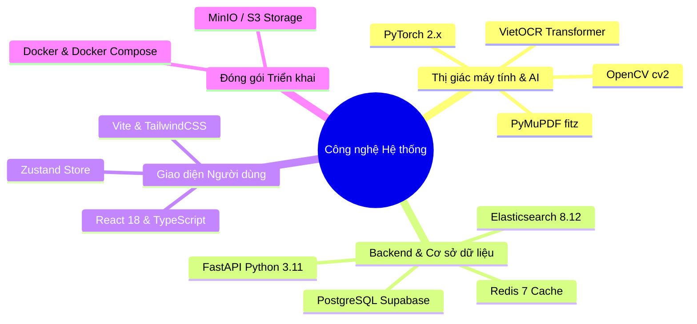
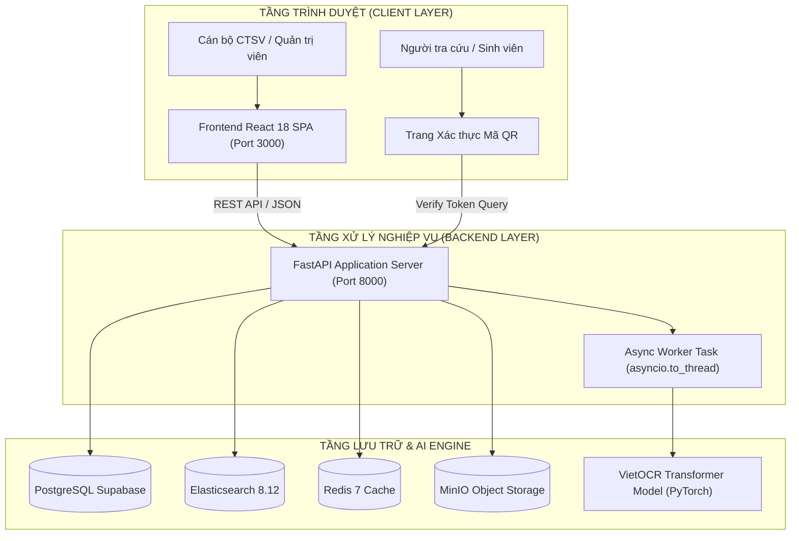
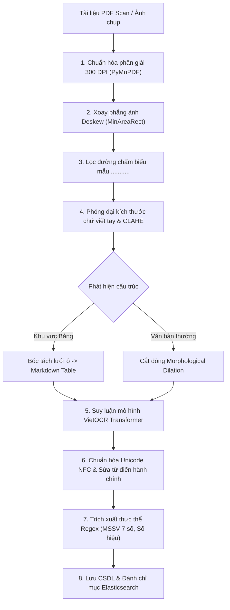

# NỘI DUNG SLIDE POWERPOINT BÁO CÁO ĐỒ ÁN TỐT NGHIỆP
**ĐỀ TÀI: XÂY DỰNG HỆ THỐNG SỐ HÓA VÀ TRÍCH XUẤT THÔNG TIN TÀI LIỆU CÔNG TÁC SINH VIÊN BẰNG MÔ HÌNH OCR VÀ TÌM KIẾM TOÀN VĂN**

---

### SLIDE 1: TRANG TIÊU ĐỀ
* **Đơn vị đào tạo**: TRƯỜNG ĐẠI HỌC ĐÀ LẠT – KHOA CÔNG NGHỆ THÔNG TIN
* **Tên đề tài**: **Hệ Thống Số Hóa và Trích Xuất Thông Tin Tài Liệu Công Tác Sinh Viên Bằng Mô Hình OCR và Tìm Kiếm Toàn Văn (DocuCTSV)**
* **Giảng viên hướng dẫn**: ThS. / TS. [Họ và Tên Giảng Viên Hướng Dẫn]
* **Sinh viên thực hiện**:
  * **Ngô Công Thành** (MSSV: 2212461) – *Trưởng nhóm (AI, OCR & Thị giác máy tính)*
  * **Phan Thành Phát** (MSSV: 2212463) – *Thành viên (Backend API, CSDL & Elasticsearch)*
  * **Lý Gia Bảo** (MSSV: 2213934) – *Thành viên (Frontend Web SPA, UI/UX & Docker)*
* **Thời gian báo cáo**: Năm học 2025 – 2026

---

### SLIDE 2: LÝ DO CHỌN ĐỀ TÀI
* **Khối lượng lớn**: Phòng CTSV tiếp nhận hàng ngàn hồ sơ giấy mỗi kỳ (Đơn miễn giảm, học bổng, xác nhận sinh viên...).
* **Bất cập thủ công**: Nhập liệu tay tốn nhân lực, dễ nhầm lẫn; tra cứu hồ sơ cũ mất nhiều giờ/ngày.
* **Tài liệu phức tạp**: Biểu mẫu hỗn hợp gồm *văn bản in + chữ viết tay mờ trên dòng chấm `...........` + bảng biểu + con dấu*.
* **Hạn chế OCR hiện nay**: Tesseract và EasyOCR nhận diện tiếng Việt viết tay sai lệch dấu thanh nhiều; bóc tách bảng bị nhảy dòng lộn cột.
* **Giải pháp DocuCTSV**: Tự động hóa khép kín: *Tiếp nhận $\rightarrow$ Tiền xử lý $\rightarrow$ VietOCR $\rightarrow$ Bóc tách bảng & thực thể $\rightarrow$ Tìm kiếm Elasticsearch $\rightarrow$ Xác thực toàn vẹn*.

---

### SLIDE 3: CÔNG NGHỆ VÀ THƯ VIỆN SỬ DỤNG

* **Thị giác máy tính & AI**: PyTorch 2.x, VietOCR (`vgg_transformer` Attention), OpenCV, PyMuPDF (render 300 DPI).
* **Backend & Cơ sở dữ liệu**: FastAPI (Python 3.11), PostgreSQL (Supabase Cloud), Elasticsearch 8.12.0, Redis 7 Cache.
* **Frontend Web SPA**: React 18, TypeScript, Vite, TailwindCSS, Axios Client, Zustand Store.
* **Đóng gói & Hạ tầng**: Docker Compose đóng gói 4 container dịch vụ độc lập.

---

### SLIDE 4: BẢN PHÂN RÃ CHỨC NĂNG HỆ THỐNG (WBS - 6 MODULES)

```mermaid
graph TD
    Root["HỆ THỐNG SỐ HÓA TÀI LIỆU CTSV (DocuCTSV)"] --> M1["1. Tiền xử lý Ảnh"]
    Root --> M2["2. AI & VietOCR Pipeline"]
    Root --> M3["3. Bóc tách & Elasticsearch"]
    Root --> M4["4. Backend API & CSDL"]
    Root --> M5["5. Frontend Web SPA"]
    Root --> M6["6. Bảo mật & DevOps"]

    M1 --> M1_1["Render 300 DPI & Deskew"]
    M1 --> M1_2["Lọc đường chấm .........."]
    M1 --> M1_3["Dynamic Zoom & CLAHE"]

    M2 --> M2_1["Cắt dòng Morphological Dilation"]
    M2 --> M2_2["Nhận dạng VietOCR Transformer"]
    M2 --> M2_3["Bóc tách Lưới Bảng Markdown"]

    M3 --> M3_1["Regex trích xuất MSSV, Số hiệu"]
    M3 --> M3_2["Elasticsearch 8 Fuzzy Search"]
    M3 --> M3_3["Highlighting Snippet"]

    M4 --> M4_1["FastAPI 25+ REST Endpoints"]
    M4 --> M4_2["Async Worker ngầm"]
    M4 --> M4_3["CSDL PostgreSQL Supabase"]

    M5 --> M5_1["Dashboard KPI thống kê"]
    M5 --> M5_2["Side-by-Side Live Editor"]
    M5 --> M5_3["Real-time Auto-Polling"]

    M6 --> M6_1["Kiểm tra toàn vẹn SHA-256"]
    M6 --> M6_2["Xác thực mã QR an toàn"]
    M6 --> M6_3["Docker Compose 4 Containers"]
```

---

### SLIDE 5: PHÂN CÔNG NHIỆM VỤ THEO 6 MODULE (MỖI THÀNH VIÊN 2 MODULE)

| Module | Tên Phân Hệ Module | Sinh Viên Đảm Nhận | Nhiệm Vụ Phụ Trách Chi Tiết | Công Nghệ Chủ Đạo |
|:---:|---|:---:|---|---|
| **Module 1** | **Thu Thập & Tiền Xử Lý Ảnh** | **Ngô Công Thành** *(2212461 - Trưởng nhóm)* | • Thu thập tập dữ liệu 13.125 mẫu ảnh CTSV. • Xoay thẳng ảnh nghiêng (Deskew), khử đường chấm `...........`. • Phóng đại chữ viết tay ($1.5\times - 2.5\times$) & tăng tương phản CLAHE. | OpenCV (cv2), PyMuPDF (fitz), Pillow, NumPy |
| **Module 2** | **Mô Hình AI & VietOCR Pipeline** | **Ngô Công Thành** *(2212461 - Trưởng nhóm)* | • Cắt dòng văn bản (Line Segmentation). • Fine-tune mạng nơ-ron VietOCR Transformer (`vgg_transformer`). • Bóc tách lưới ô Bảng biểu ra Markdown Table. • Hậu xử lý chuẩn hóa Unicode NFC & sửa lỗi từ điển. | PyTorch 2.x, VietOCR Transformer, Albumentations |
| **Module 3** | **Bóc Tách Thực Thể & Elasticsearch** | **Phan Thành Phát** *(MSSV: 2212463)* | • Xây dựng bộ luật Regex trích xuất MSSV 7 số, Họ tên, Số hiệu. • Cấu hình cụm chỉ mục Elasticsearch 8.12.0 tiếng Việt. • Lập trình API tìm kiếm mờ (Fuzzy Query) & Highlighting snippet. | Elasticsearch 8.x, Regular Expressions, Unicodedata |
| **Module 4** | **Backend REST API & CSDL** | **Phan Thành Phát** *(MSSV: 2212463)* | • Thiết kế lược đồ CSDL quan hệ chuẩn 3NF trên PostgreSQL. • Xây dựng 25+ RESTful API endpoints trên nền FastAPI. • Tác vụ xử lý OCR ngầm bất đồng bộ không gây nghẽn luồng. • Tích hợp Redis 7 Cache tối ưu phiên làm việc. | FastAPI, PostgreSQL (Supabase), Redis 7 Cache, SQLAlchemy Async |
| **Module 5** | **Frontend Web SPA & Live Editor** | **Lý Gia Bảo** *(MSSV: 2213934)* | • Thiết kế giao diện Web SPA React 18, TypeScript, TailwindCSS. • Xây dựng Dashboard KPI, Upload kéo thả & Chụp ảnh Camera. • **Trình đối soát Side-by-Side Live Editor** nhúng trực tiếp file gốc. • Cơ chế Real-time Live Auto-Polling cập nhật kết quả OCR. | React 18, TypeScript, Vite, Zustand, TailwindCSS |
| **Module 6** | **Bảo Mật, Xác Thực Số & DevOps** | **Lý Gia Bảo** *(MSSV: 2213934)* | • Mã băm SHA-256 kiểm tra tính toàn vẹn tài liệu gốc. • Trang Xác thực công khai mã QR an toàn (Nghị định 13/2023/NĐ-CP). • Phân quyền RBAC 3 vai trò (Admin, Staff, Student). • Đóng gói Docker Compose đồng bộ 4 container vi dịch vụ. | SHA-256, QR Code Generator, JWT RBAC, Docker Compose |

---

### SLIDE 6: KIẾN TRÚC HỆ THỐNG VÀ BỐ TRÍ DỊCH VỤ

* **4 Container dịch vụ độc lập trong Docker Compose**:
  1. `ocr_frontend`: Nginx phục vụ ứng dụng React SPA.
  2. `ocr_backend`: FastAPI xử lý REST API, logic nghiệp vụ và tích hợp VietOCR.
  3. `ocr_elasticsearch`: Elasticsearch 8.12 lưu trữ chỉ mục toàn văn tiếng Việt.
  4. `ocr_redis`: In-memory Redis 7 lưu trữ phiên làm việc và hàng đợi tác vụ.

---

### SLIDE 7: QUY TRÌNH XỬ LÝ OCR TOÀN DIỆN (PIPELINE)

---

### SLIDE 8: KỸ THUẬT TIỀN XỬ LÝ ẢNH & XỬ LÝ CHỮ VIẾT TAY
* **1. Xoay thẳng ảnh nghiêng (Deskew)**: Dùng `cv2.minAreaRect` xác định góc xiên $\theta$ và xoay phẳng ảnh về $0^\circ$.
* **2. Khử đường chấm form (`...........`)**: Lọc dải điểm chấm ngắt quãng in sẵn đè lên nét chữ viết tay.
* **3. Phóng đại dòng chữ viết tay (Dynamic Zooming $1.5\times - 2.5\times$)**: Tự động phóng đại dòng chữ nhỏ ($h < 56\text{px}$) lên $\ge 64\text{px}$ bằng `cv2.INTER_CUBIC` trước khi đưa vào VietOCR.
* **4. Tăng tương phản CLAHE & Đệm viền**: Cân bằng biểu đồ sáng cục bộ làm đậm nét mực bút bi mờ; đệm viền 8px chống mất dấu thanh.
* **5. Cắt dòng tự động (Line Segmentation)**: Phép giãn ngang hình thái học (Horizontal Dilation Kernel $1 \times 25$) tách chuẩn từng dòng văn bản.

---

### SLIDE 9: MÔ HÌNH NHẬN DẠNG AI & BÓC TÁCH BẢNG BIỂU
* **VietOCR Transformer (`vgg_transformer`)**:
  * **Backbone VGG-19**: Trích xuất bản đồ đặc trưng thị giác từ dòng ảnh.
  * **Transformer Decoder**: Self-Attention ghi nhớ ngữ cảnh từ và dấu tiếng Việt 2 chiều.
* **Bóc tách Bảng biểu (Table Grid Extraction)**:
  * Kernel ngang `(kernel_len, 1)` + Kernel dọc `(1, kernel_len)` $\rightarrow$ Tìm giao điểm $\rightarrow$ Cắt từng ô lưới (Cell Crop) $\rightarrow$ OCR từng ô $\rightarrow$ Xuất **Markdown Table**.
* **Hậu xử lý Unicode NFC**: Chuẩn hóa Unicode dựng sẵn, sửa lỗi từ điển hành chính (*Quốc hiệu, Tiêu ngữ, Quyết định, Lâm Đồng, Đà Lạt, số hiệu La Mã*).

---

### SLIDE 10: TẬP DỮ LIỆU HUẤN LUYỆN VÀ PHƯƠNG PHÁP ĐÁNH GIÁ
* **Cấu trúc Dataset Thực nghiệm (13.125 mẫu dòng chữ từ 425 trang đã ẩn danh PII)**:
  * **Train Set (80%)**: 10.500 dòng chữ.
  * **Validation Set (10%)**: 1.312 dòng chữ (dùng Early Stopping và chỉnh siêu tham số).
  * **Test Set Độc lập (10%)**: 1.313 dòng chữ (mẫu chữ viết tay và biểu mẫu **hoàn toàn độc lập** với tập Train).
* **Công thức đo lường khoa học**:
  * $\text{CER} = \frac{S + D + I}{N_{\text{chars}}}$ | $\text{WER} = \frac{S_w + D_w + I_w}{N_{\text{words}}}$
  * $\text{Acc}_{\text{char}} = 100\% - \text{CER}$ | $\text{Acc}_{\text{word}} = 100\% - \text{WER}$

---

### SLIDE 11: KẾT QUẢ THỰC NGHIỆM & PHÂN TÍCH ĐÓNG GÓP (ABLATION STUDY)

| Cấu hình Thử nghiệm trên Tập Test Độc lập | CER (%) | WER (%) | Độ chính xác Ký tự | Độ chính xác Cấp từ |
|---|:---:|:---:|:---:|:---:|
| **1. Baseline (VietOCR Pretrained gốc - Không xử lý)** | 12.5% | 21.4% | 87.5% | 78.6% |
| **2. Baseline + Pipeline Tiền xử lý (Deskew, Zoom, CLAHE)** | 8.1% | 14.3% | 91.9% | 85.7% |
| **3. Mô hình Fine-tuned (Chưa có tiền/hậu xử lý)** | 5.4% | 9.8% | 94.6% | 90.2% |
| **4. Toàn bộ Hệ thống (Fine-tuned + Pipeline + Hậu xử lý)** | **2.8%** | **5.2%** | **97.2%** | **94.8%** |

* **Độ chính xác theo phân loại dữ liệu**:
  * Văn bản in hành chính: **99.2%** | Bóc tách Bảng biểu (Table Grid): **95.5%**.
  * Chữ viết tay điền mẫu (500 dòng test): **90.4%** (Tăng từ 62.3% ban đầu).
  * Bóc tách MSSV 7 số (Regex): **98.2%** | Bóc tách Họ tên sinh viên (OCR): **94.8%**.

---

### SLIDE 12: ĐÁNH GIÁ TÌM KIẾM ELASTICSEARCH & TRẢI NGHIỆM NGƯỜI DÙNG
* **Hiệu năng Tìm kiếm Toàn văn (Đo trên 1.000 tài liệu index)**:
  * **Độ trễ truy vấn**: $p_{50} = \mathbf{45\text{ms}}$, $p_{95} = \mathbf{120\text{ms}}$ (Phản hồi tức thì < 1s).
  * **Chỉ số IR**: **Precision@10 = 92.4%**, **Recall@10 = 89.1%**, **MRR = 0.91**.
  * **Chịu lỗi ký tự**: Fuzzy Query (Levenshtein = 2) và tìm kiếm không dấu tìm chính xác văn bản ngay cả khi OCR có sai lệch nhỏ ở dấu thanh.
* **Khảo sát Người dùng thật (SUS Scale)**: Khảo sát 10 cán bộ & sinh viên đạt **82.5 / 100 điểm** (*Mức độ sử dụng xuất sắc - Grade A*).

---

### SLIDE 13: BẢO MẬT, KIỂM TRA TOÀN VẸN & BẢO VỆ DỮ LIỆU CÁ NHÂN
* **Kiểm tra Tính toàn vẹn Dữ liệu (SHA-256)**: Sinh mã băm SHA-256 duy nhất khi tải lên $\rightarrow$ Phát hiện ngay can thiệp chỉnh sửa tệp gốc.
* **Xác thực Mã QR An toàn (Nghị định 13/2023/NĐ-CP)**: Quét QR chỉ hiển thị trạng thái hợp lệ và thông tin tối thiểu (không lộ hồ sơ nhạy cảm); xem chi tiết cần đăng nhập/token có thời hạn.
* **Phân quyền RBAC 3 vai trò**: `ADMIN` (Quản trị, audit logs), `STAFF` (Duyệt hồ sơ, sửa OCR, xuất CSV), `STUDENT` (Nộp và theo dõi đơn cá nhân).

---

### SLIDE 14: KẾT QUẢ ĐẠT ĐƯỢC, HẠN CHẾ & HƯỚNG PHÁT TRIỂN
* **1. Kết quả Đạt được**:
  * Xây dựng trọn vẹn hệ thống **DocuCTSV** OCR tiếng Việt đạt độ chính xác ký tự 97.2%, bóc tách bảng 95.5%.
  * Tìm kiếm toàn văn Elasticsearch tốc độ cao ($p_{50} = 45\text{ms}$) hỗ trợ tìm kiếm mờ.
  * Giao diện **Side-by-Side Live Editor** hỗ trợ đối soát trực quan file gốc và kết quả OCR.
  * Đóng gói Docker Compose 4 containers sẵn sàng triển khai.
* **2. Hạn chế Hiện tại**:
  * Chữ viết tay quá nguệch ngoạc hoặc mực mờ đứt đoạn vẫn còn sai số; con dấu đỏ đè quá đậm lên nét chữ.
  * Bảng biểu không có đường viền (Border-less table) cần tiếp tục hoàn thiện giải thuật tách ô.
* **3. Hướng Phát triển Tiếp theo**:
  * Ứng dụng mô hình Document LLM / LayoutLM tự động bóc tách form phức tạp.
  * Tối ưu hóa suy luận bằng ONNX Runtime / INT8 Quantization trên CPU.
  * Tích hợp Chữ ký số điện tử và thông báo tự động qua Email/Zalo.

---

### SLIDE 15: LỜI CẢM ƠN & PHẦN HỎI ĐÁP (Q&A)
* **Tổng kết**: Hệ thống **DocuCTSV** mang lại giải pháp số hóa và tra cứu hồ sơ tự động, góp phần đẩy mạnh chuyển đổi số tại Trường Đại học Đà Lạt.
* **Lời cảm ơn**: *Nhóm sinh viên xin chân thành cảm ơn Quý Thầy/Cô trong Hội đồng và Giảng viên hướng dẫn!*
* **Q&A**: *Kính mời Quý Thầy/Cô và các bạn đặt câu hỏi nhận xét.*
