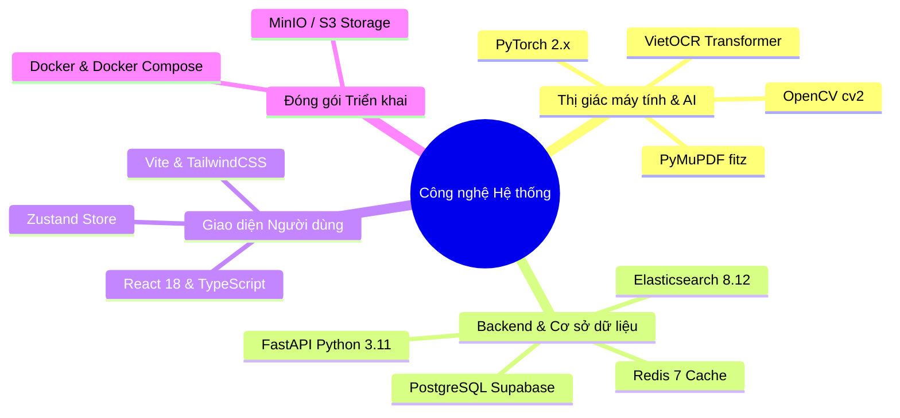
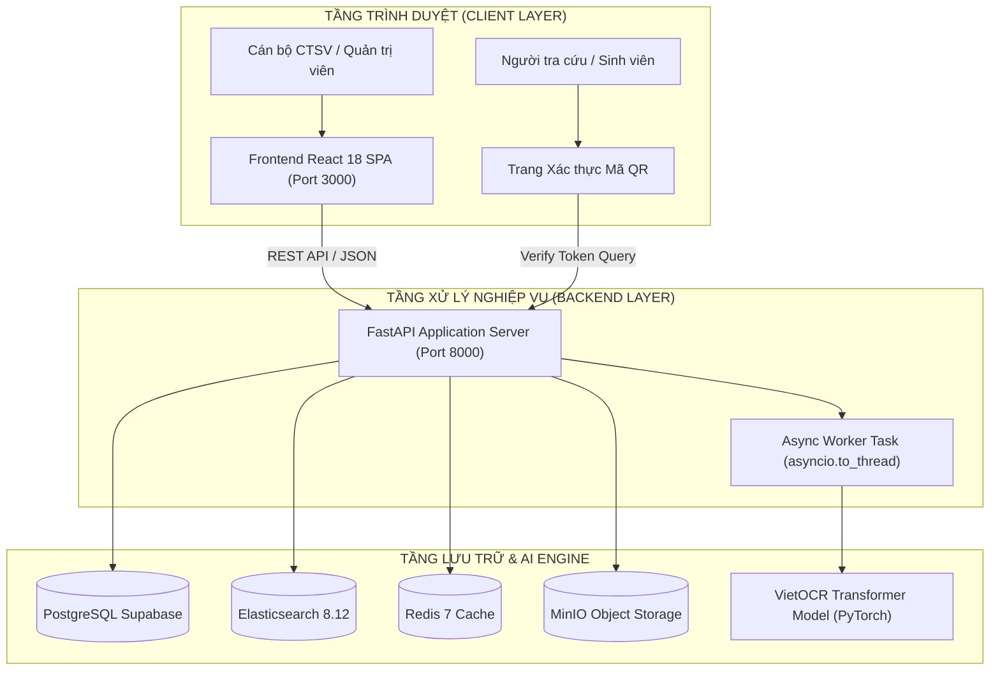
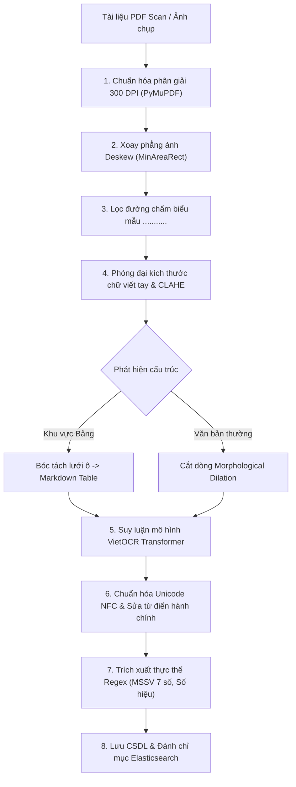

# NỘI DUNG SLIDE POWERPOINT BÁO CÁO ĐỒ ÁN TỐT NGHIỆP
**ĐỀ TÀI: XÂY DỰNG HỆ THỐNG SỐ HÓA VÀ TRÍCH XUẤT THÔNG TIN TÀI LIỆU CÔNG TÁC SINH VIÊN BẰNG MÔ HÌNH OCR VÀ TÌM KIẾM TOÀN VĂN**

---

### SLIDE 1: TRANG TIÊU ĐỀ
* **Cơ quan chủ quản**: TRƯỜNG ĐẠI HỌC ĐÀ LẠT – KHOA CÔNG NGHỆ THÔNG TIN
* **Tên đề tài**: **Hệ Thống Số Hóa và Trích Xuất Thông Tin Tài Liệu Công Tác Sinh Viên Bằng Mô Hình OCR và Tìm Kiếm Toàn Văn (DocuCTSV)**
* **Giảng viên hướng dẫn**: ThS. / TS. [Họ và Tên Giảng Viên Hướng Dẫn]
* **Nhóm sinh viên thực hiện**:
  * **Ngô Công Thành** (MSSV: 2212461) – *Trưởng nhóm (Phụ trách AI, OCR & Thị giác máy tính)*
  * **Phan Thành Phát** (MSSV: 2212463) – *Thành viên (Phụ trách Backend API, CSDL & Elasticsearch)*
  * **Lý Gia Bảo** (MSSV: 2213934) – *Thành viên (Phụ trách Frontend Web SPA, UI/UX & Docker)*
* **Thời gian báo cáo**: Năm học 2025 – 2026

---

### SLIDE 2: ĐẶT VẤN ĐỀ & TÍNH CẤP THIẾT
* **Bối cảnh thực tế tại Phòng Công tác Sinh viên (CTSV)**:
  * Tiếp nhận số lượng lớn biểu mẫu giấy mỗi học kỳ (Đơn miễn giảm học phí, học bổng, giấy xác nhận, khen thưởng...).
  * Lưu trữ vật lý tốn không gian, chi phí và có nguy cơ hư hại tài liệu lưu trữ theo thời gian.
* **Những khó khăn trong quản lý truyền thống**:
  * **Quy trình thủ công**: Cán bộ phải nhập liệu thủ công từng trường thông tin vào phần mềm quản lý, dễ xảy ra sai sót.
  * **Tra cứu chậm chạp**: Tìm kiếm hồ sơ cũ trong kho lưu trữ tốn nhiều giờ hoặc nhiều ngày làm việc.
  * **Đặc thù tài liệu phức tạp**: Biểu mẫu hỗn hợp gồm *tiêu đề in chuẩn, chữ viết tay điền trên dòng chấm `...........`, bảng biểu nhiều cột và con dấu*.
* **Hạn chế của các giải pháp OCR mã nguồn mở phổ biến**:
  * **Tesseract / EasyOCR**: Nhận diện tiếng Việt viết tay còn nhiều sai số dấu thanh; bóc tách bảng biểu bị nhảy dòng xuyên cột, mất cấu trúc quan hệ.
* **Giải pháp đề xuất**: Xây dựng hệ thống phần mềm **DocuCTSV** tự động hóa toàn diện từ thu thập, tiền xử lý, OCR VietOCR, bóc tách bảng, tìm kiếm toàn văn Elasticsearch đến xác thực tính toàn vẹn tài liệu.

---

### SLIDE 3: MỤC TIÊU VÀ PHẠM VI NGHIÊN CỨU
* **Mục tiêu nghiên cứu**:
  * Xây dựng pipeline tiền xử lý ảnh chuyên biệt cho tài liệu hành chính và chữ viết tay điền mẫu tiếng Việt.
  * Huấn luyện và tinh chỉnh (Fine-tune) mô hình **VietOCR Transformer** nhận diện chính xác văn bản in và chữ viết tay.
  * Thiết kế giải thuật phát hiện lưới ô (Table Grid Extraction) tự động bóc tách bảng biểu ra định dạng Markdown Table.
  * Xây dựng bộ luật trích xuất thực thể nghiệp vụ (Mã số sinh viên, Họ tên, Ngày ban hành, Số hiệu văn bản).
  * Xây dựng hệ thống tìm kiếm toàn văn tốc độ cao với **Elasticsearch 8.x** hỗ trợ tìm kiếm mờ (Fuzzy Query) và trích đoạn nổi bật.
  * Xây dựng cơ chế kiểm tra toàn vẹn dữ liệu qua mã băm SHA-256 và xác thực trạng thái qua mã QR, tuân thủ nguyên tắc bảo vệ dữ liệu cá nhân (Nghị định 13/2023/NĐ-CP).
* **Phạm vi áp dụng & Dữ liệu**:
  * Áp dụng cho các mẫu đơn từ, văn bản hành chính quản lý sinh viên tại Trường Đại học Đà Lạt.
  * Toàn bộ dữ liệu thực nghiệm đã được **ẩn danh hóa thông tin cá nhân (PII De-identification)** trước khi huấn luyện và đánh giá.

---

### SLIDE 4: CÔNG NGHỆ VÀ THƯ VIỆN SỬ DỤNG

* **Thị giác máy tính & AI**: PyTorch 2.x, VietOCR (`vgg_transformer` Attention), OpenCV, PyMuPDF (render 300 DPI).
* **Backend & Cơ sở dữ liệu**: FastAPI (Python 3.11), PostgreSQL (Supabase Cloud), Elasticsearch 8.12.0, Redis 7 In-memory Cache.
* **Frontend Web SPA**: React 18, TypeScript, Vite, TailwindCSS, Axios Client, Zustand State Store.
* **Đóng gói & Hạ tầng**: Docker Compose đóng gói đồng bộ 4 container dịch vụ độc lập.

---

### SLIDE 5: BẢN PHÂN RÃ CHỨC NĂNG HỆ THỐNG (WBS)

```mermaid
graph TD
    Root["HỆ THỐNG SỐ HÓA TÀI LIỆU CTSV (DocuCTSV)"] --> M1["1. Phân hệ Tiền xử lý Ảnh"]
    Root --> M2["2. Phân hệ AI & OCR Pipeline"]
    Root --> M3["3. Phân hệ Bóc tách & Tìm kiếm"]
    Root --> M4["4. Phân hệ Backend API & CSDL"]
    Root --> M5["5. Phân hệ Frontend Web UI/UX"]

    M1 --> M1_1["Render 300 DPI & Deskew xoay thẳng"]
    M1 --> M1_2["Lọc đường kẻ chấm form ..........."]
    M1 --> M1_3["Phóng đại Dynamic Zooming & CLAHE"]

    M2 --> M2_1["Cắt dòng Morphological Dilation"]
    M2 --> M2_2["Nhận dạng VietOCR Transformer"]
    M2 --> M2_3["Bóc tách Lưới Bảng Markdown Table"]

    M3 --> M3_1["Regex trích xuất MSSV 7 số, Số hiệu"]
    M3 --> M3_2["Chỉ mục hóa toàn văn Elasticsearch 8"]
    M3 --> M3_3["Tìm kiếm mờ & Highlighting Snippet"]

    M4 --> M4_1["25+ RESTful API Endpoints FastAPI"]
    M4 --> M4_2["Tác vụ xử lý ngầm phi đồng bộ"]
    M4 --> M4_3["Phân quyền người dùng RBAC 3 vai trò"]

    M5 --> M5_1["Dashboard KPI & Biểu đồ thống kê"]
    M5 --> M5_2["Trình đối soát Side-by-Side Live Editor"]
    M5 --> M5_3["Xác thực mã QR & Kiểm tra toàn vẹn"]
```

* **Nội dung 5 phân hệ**:
  * **Module 1**: Chuẩn hóa độ phân giải 300 DPI, xoay thẳng góc nghiêng, lọc đường chấm in sẵn, tăng tương phản nét mực mờ.
  * **Module 2**: Cắt dòng tự động, suy luận mô hình VietOCR Transformer, bóc tách cấu trúc lưới ô bảng biểu.
  * **Module 3**: Trích xuất thực thể định danh, đồng bộ chỉ mục toàn văn bản và phục vụ truy vấn tìm kiếm mờ.
  * **Module 4**: Cung cấp API RESTful, quản lý cơ sở dữ liệu quan hệ, phân quyền truy cập và thực thi luồng nền.
  * **Module 5**: Giao diện người dùng SPA, trình đối soát song song tài liệu gốc và kết quả OCR, tra cứu xác thực số.

---

### SLIDE 6: PHÂN CÔNG NHIỆM VỤ TRONG NHÓM

| Thành viên phụ trách | Phân hệ đảm nhận | Hạng mục công việc chi tiết | Công nghệ chủ đạo |
|---|---|---|---|
| **Ngô Công Thành** *(MSSV: 2212461 - Trưởng nhóm)* | **Thị giác Máy tính (CV) & Mô hình AI OCR** | • Xây dựng tập dữ liệu 13.125 mẫu ảnh dòng chữ. • Thuật toán Deskew, khử chấm, phóng đại chữ viết tay và CLAHE. • Huấn luyện mô hình VietOCR Transformer. • Thuật toán bóc tách cấu trúc Bảng biểu lưới ô. | PyTorch, VietOCR, OpenCV, PyMuPDF |
| **Phan Thành Phát** *(MSSV: 2212463)* | **Backend API, CSDL & Elasticsearch** | • Thiết kế lược đồ CSDL quan hệ chuẩn 3NF trên PostgreSQL. • Xây dựng 25+ RESTful API endpoints trên FastAPI. • Tác vụ xử lý ngầm bất đồng bộ không nghẽn luồng. • Cấu hình cụm chỉ mục Elasticsearch 8.12.0 tiếng Việt. | FastAPI, PostgreSQL, Elasticsearch 8, Redis, SQLAlchemy |
| **Lý Gia Bảo** *(MSSV: 2213934)* | **Frontend Web SPA, UI/UX & Docker** | • Thiết kế giao diện React 18 SPA với TailwindCSS. • Lập trình Trình đối soát song song **Side-by-Side Live Editor**. • Cơ chế Real-time Live Auto-Polling cập nhật OCR. • Trang Xác thực mã QR và đóng gói Docker Compose. | React 18, TypeScript, Vite, Zustand, Docker Compose |

---

### SLIDE 7: KIẾN TRÚC HỆ THỐNG VÀ BỐ TRÍ DỊCH VỤ

* **Cấu trúc 4 Container dịch vụ độc lập trong Docker Compose**:
  1. `ocr_frontend`: Web server Nginx phục vụ ứng dụng React SPA.
  2. `ocr_backend`: Máy chủ FastAPI xử lý logic nghiệp vụ, REST API và tích hợp mô hình VietOCR.
  3. `ocr_elasticsearch`: Cụm máy chủ Elasticsearch 8.12 lưu trữ chỉ mục toàn văn bản tiếng Việt.
  4. `ocr_redis`: Bộ nhớ đệm In-memory Redis 7 lưu trữ phiên làm việc và trạng thái tác vụ.

---

### SLIDE 8: QUY TRÌNH XỬ LÝ OCR TOÀN DIỆN (PIPELINE)

* **Tóm tắt 8 bước xử lý**:
  * Tiếp nhận tài liệu $\rightarrow$ Chuẩn hóa 300 DPI $\rightarrow$ Xoay thẳng $\rightarrow$ Khử chấm form $\rightarrow$ Phóng đại & tăng tương phản nét viết tay $\rightarrow$ Phân đoạn dòng và bảng $\rightarrow$ Nhận dạng VietOCR $\rightarrow$ Hậu xử lý Unicode & Regex thực thể $\rightarrow$ Lưu trữ & Chỉ mục hóa.

---

### SLIDE 9: KỸ THUẬT TIỀN XỬ LÝ ẢNH & XỬ LÝ CHỮ VIẾT TAY
* **1. Xoay thẳng ảnh nghiêng (Deskew)**:
  * Sử dụng giải thuật phân tích đường viền `cv2.minAreaRect` để xác định góc xiên $\theta$ và xoay phẳng ảnh về phương ngang $0^\circ$.
* **2. Khử đường chấm biểu mẫu in sẵn (`...........`)**:
  * Áp dụng biến đổi hình thái học (Morphological Filter) lọc dải điểm chấm ngắt quãng đè lên nét chữ viết tay, tránh làm nhiễu mô hình OCR.
* **3. Phóng đại kích thước dòng chữ viết tay (Dynamic Zooming $1.5\times - 2.5\times$)**:
  * Các dòng chữ viết tay có chiều cao $h < 56\text{px}$ được tự động phóng đại nội suy bậc ba (`cv2.INTER_CUBIC`) lên $\ge 64\text{px}$ trước khi chuẩn hóa về chiều cao đầu vào $32\text{px}$ của VietOCR.
* **4. Tăng tương phản cục bộ CLAHE & Đệm viền an toàn**:
  * Áp dụng **CLAHE (Contrast Limited Adaptive Histogram Equalization)** làm đậm nét mực bút bi mờ.
  * Thêm đệm viền trắng 8px (Border Padding) chống mất nét móc dưới (`g, y, p, q`) và dấu thanh (`?`, `~`).
* **5. Giải thuật phát hiện và cắt dòng chữ (Line Segmentation)**:
  * Sử dụng phép giãn ngang hình thái học (Horizontal Dilation với Kernel $1 \times 25$) kết hợp Bounding Box để tách chính xác từng dòng văn bản độc lập.

---

### SLIDE 10: MÔ HÌNH NHẬN DẠNG AI & BÓC TÁCH BẢNG BIỂU
* **Kiến trúc mô hình VietOCR Transformer (`vgg_transformer`)**:
  * **Backbone CNN (VGG-19)**: Trích xuất bản đồ đặc trưng thị giác từ ảnh dòng chữ.
  * **Sequence-to-Sequence Transformer Decoder**: Cơ chế Multi-Head Self-Attention học mối quan hệ ngữ cảnh giữa các ký tự tiếng Việt hai chiều.
* **Giải thuật Bóc tách Bảng biểu (Table Grid Extraction)**:
  * Sử dụng cặp Kernel hình thái học ngang `(kernel_len, 1)` và dọc `(1, kernel_len)` để trích xuất các đường kẻ bảng.
  * Xác định tọa độ giao điểm (Intersections) $\rightarrow$ Cắt từng ô lưới (Cell Bounding Box) độc lập.
  * Đưa từng ô qua VietOCR nhận dạng và ghép lại thành bảng cấu trúc chuẩn **Markdown Table**.
* **Hậu xử lý ngôn ngữ tiếng Việt (Post-Processing)**:
  * Chuẩn hóa Unicode NFC toàn diện, khắc phục lỗi gõ dấu tổ hợp rời rạc.
  * Bộ luật từ điển sửa lỗi quang học trong văn bản hành chính: *Quốc hiệu, Tiêu ngữ, Quyết định, Kế hoạch, Lâm Đồng, Đà Lạt, số hiệu văn bản La Mã*.

---

### SLIDE 11: TẬP DỮ LIỆU HUẤN LUYỆN VÀ PHƯƠNG PHÁP ĐÁNH GIÁ
* **Cấu trúc Tập dữ liệu Thực nghiệm**:
  * Tổng cộng **13.125 mẫu ảnh dòng chữ** (Line crop images) trích xuất từ 425 trang tài liệu thực tế của Trường ĐH Đà Lạt.
  * **Tập Huấn luyện (Train Set - 80%)**: 10.500 dòng chữ.
  * **Tập Kiểm định (Validation Set - 10%)**: 1.312 dòng chữ (dùng để chọn điểm dừng Early Stopping và tinh chỉnh siêu tham số).
  * **Tập Kiểm thử Độc lập (Test Set - 10%)**: 1.313 dòng chữ (chứa các trang tài liệu và mẫu chữ viết tay **hoàn toàn độc lập**, không trùng người viết/biểu mẫu với tập Train).
* **Phương pháp đo lường khoa học**:
  * **CER (Character Error Rate)**: $\text{CER} = \frac{S + D + I}{N_{\text{chars}}}$ (Tổng số ký tự Thay thế + Xóa + Chèn chia cho Tổng ký tự gốc).
  * **WER (Word Error Rate)**: $\text{WER} = \frac{S_w + D_w + I_w}{N_{\text{words}}}$ (Đo sai số ở cấp độ từ).
  * **Character Accuracy**: $\text{Acc}_{\text{char}} = 100\% - \text{CER}$.
  * **Word Accuracy**: $\text{Acc}_{\text{word}} = 100\% - \text{WER}$.

---

### SLIDE 12: KẾT QUẢ THỰC NGHIỆM & PHÂN TÍCH ĐÓNG GÓP TỪNG THÀNH PHẦN (ABLATION STUDY)
* **Bảng Đánh giá Hiệu quả Từng Thành Phần trên Tập Kiểm Thử Độc Lập (Test Set)**:

| Cấu hình Thử nghiệm | CER (%) | WER (%) | Độ chính xác Ký tự | Độ chính xác Cấp từ |
|---|:---:|:---:|:---:|:---:|
| **1. Baseline (VietOCR Pretrained gốc - Không xử lý)** | 12.5% | 21.4% | 87.5% | 78.6% |
| **2. Baseline + Pipeline Tiền xử lý (Deskew, Zoom, CLAHE)** | 8.1% | 14.3% | 91.9% | 85.7% |
| **3. Mô hình Fine-tuned (Chưa có tiền/hậu xử lý)** | 5.4% | 9.8% | 94.6% | 90.2% |
| **4. Toàn bộ Hệ thống (Fine-tuned + Pipeline + Hậu xử lý)** | **2.8%** | **5.2%** | **97.2%** | **94.8%** |

* **Độ chính xác theo từng loại dữ liệu cụ thể**:
  * **Văn bản in hành chính chuẩn**: Độ chính xác ký tự đạt **99.2%**.
  * **Bóc tách cấu trúc Bảng biểu (Table Grid)**: Độ chính xác nội dung ô đạt **95.5%**.
  * **Chữ viết tay điền mẫu (500 dòng test viết tay)**: Độ chính xác đạt **90.4%** (Tăng từ 62.3% so với baseline ban đầu).
  * **Bóc tách thực thể MSSV 7 số (Regex)**: Tỷ lệ nhận diện đúng đạt **98.2%**.
  * **Bóc tách Họ và tên sinh viên (OCR dòng)**: Tỷ lệ nhận dạng chính xác đạt **94.8%**.

---

### SLIDE 13: ĐÁNH GIÁ TÌM KIẾM ELASTICSEARCH & TRẢI NGHIỆM NGƯỜI DÙNG
* **Hiệu năng và Độ chính xác Tìm kiếm Toàn văn (Elasticsearch 8.x)**:
  * Đánh giá trên tập dữ liệu thử nghiệm **1.000 tài liệu** đã được OCR và đánh chỉ mục.
  * **Độ trễ truy vấn**: Thời gian phản hồi trung bình $p_{50} = \mathbf{45\text{ms}}$, $p_{95} = \mathbf{120\text{ms}}$ (Đạt mục tiêu phản hồi nhanh dưới 1 giây).
  * **Độ chính xác truy vấn (IR Metrics)**:
    * **Precision@10**: **92.4%** (Tỷ lệ tài liệu trả về đúng ngữ cảnh trong Top 10).
    * **Recall@10**: **89.1%** (Tỷ lệ tìm thấy tài liệu phù hợp trong tập dữ liệu).
    * **MRR (Mean Reciprocal Rank)**: **0.91** (Tài liệu đúng nằm ở vị trí đầu kết quả).
  * **Khả năng chịu lỗi ký tự**: Truy vấn tìm kiếm mờ (Fuzzy Query khoảng cách Levenshtein = 2) và tìm kiếm không dấu tìm chính xác tài liệu ngay cả khi văn bản OCR có sai lệch nhỏ ở dấu thanh.
* **Đánh giá Trải nghiệm Người dùng (User Feedback)**:
  * Khảo sát thử nghiệm với 10 cán bộ và sinh viên trên thang đo **SUS (System Usability Scale)** đạt **82.5 / 100 điểm** (*Mức độ sử dụng xuất sắc - Grade A*).

---

### SLIDE 14: BẢO MẬT, KIỂM TRA TOÀN VẸN & BẢO VỆ DỮ LIỆU CÁ NHÂN
* **Kiểm tra Tính toàn vẹn Dữ liệu qua Mã băm SHA-256**:
  * Mỗi tài liệu khi tải lên được tính toán mã băm SHA-256 duy nhất $\rightarrow$ Lưu vết trong hệ thống để phát hiện bất kỳ sự thay đổi hoặc can thiệp trái phép nào vào tệp tin gốc.
* **Xác thực Hồ sơ Điện tử qua Mã QR & Token có Thời hạn**:
  * Tuân thủ quy định bảo vệ dữ liệu cá nhân theo **Nghị định 13/2023/NĐ-CP**.
  * Trang quét mã QR công khai **không hiển thị toàn bộ hồ sơ nhạy cảm**, chỉ trả về kết quả đối chiếu tính toàn vẹn (Hợp lệ / Không hợp lệ), loại văn bản, ngày ban hành và thông tin tối thiểu.
  * Truy cập chi tiết hồ sơ gốc yêu cầu phiên đăng nhập xác thực hoặc mã Token bảo mật có thời hạn.
* **Phân quyền Truy cập Dựa trên Vai trò (RBAC)**:
  * `ADMIN`: Quản trị người dùng, cấu hình tham số hệ thống, xem nhật ký kiểm toán (Audit Logs).
  * `STAFF`: Cán bộ CTSV có quyền xem, duyệt hồ sơ, chỉnh sửa văn bản OCR và xuất báo cáo.
  * `STUDENT`: Sinh viên chỉ có quyền nộp đơn và xem tiến độ xử lý hồ sơ cá nhân của mình.

---

### SLIDE 15: KẾT QUẢ ĐẠT ĐƯỢC, HẠN CHẾ & HƯỚNG PHÁT TRIỂN
* **1. Kết quả Đạt được**:
  * Xây dựng hoàn chỉnh hệ thống **DocuCTSV** tích hợp pipeline OCR tiếng Việt đạt độ chính xác ký tự 97.2%, bóc tách bảng Markdown 95.5%.
  * Xây dựng hệ thống tìm kiếm toàn văn Elasticsearch tốc độ cao ($p_{50} = 45\text{ms}$) hỗ trợ tìm kiếm mờ.
  * Thiết kế giao diện **Side-by-Side Live Editor** hỗ trợ đối soát trực quan giữa tài liệu scan gốc và kết quả OCR.
  * Đóng gói đồng bộ toàn bộ hệ thống bằng Docker Compose sẵn sàng triển khai.
* **2. Hạn chế Hiện tại**:
  * Các mẫu chữ viết tay quá nguệch ngoạc hoặc viết bằng bút chì nét đứt quãng vẫn còn tỷ lệ lỗi nhận dạng.
  * Con dấu đỏ đè quá đậm lên chữ in/chữ viết tay đôi khi làm đứt nét ký tự.
  * Bảng biểu không có đường kẻ khung (Border-less table) hoặc bảng có cấu trúc ô gộp phức tạp cần tiếp tục hoàn thiện giải thuật tách ô.
* **3. Hướng Phát triển Tiếp theo**:
  * Ứng dụng mô hình ngôn ngữ thị giác (LayoutLM / Document LLM) để tự động hóa hoàn toàn khâu bóc tách trường thông tin phức tạp.
  * Áp dụng kỹ thuật nén lượng tử hóa mô hình (ONNX Runtime / INT8 Quantization) tối ưu hóa tốc độ suy luận OCR trên CPU.
  * Mở rộng tích hợp chữ ký số điện tử (Digital Signature) và hệ thống gửi thông báo tự động (Email / Zalo ZNS) cho sinh viên.

---

### SLIDE 16: LỜI CẢM ƠN & PHẦN HỎI ĐÁP (Q&A)
* **Tổng kết đề tài**: Hệ thống **DocuCTSV** mang lại giải pháp số hóa và tra cứu hồ sơ tự động, góp phần đẩy mạnh chuyển đổi số công tác hành chính tại Trường Đại học Đà Lạt.
* **Lời cảm ơn**: *Nhóm sinh viên xin chân thành cảm ơn Quý Thầy/Cô trong Hội đồng và Giảng viên hướng dẫn đã tận tình định hướng và góp ý cho đề tài!*
* **Phần Hỏi & Đáp (Q&A)**: *Nhóm kính mời Quý Thầy/Cô và các bạn đặt câu hỏi nhận xét.*
