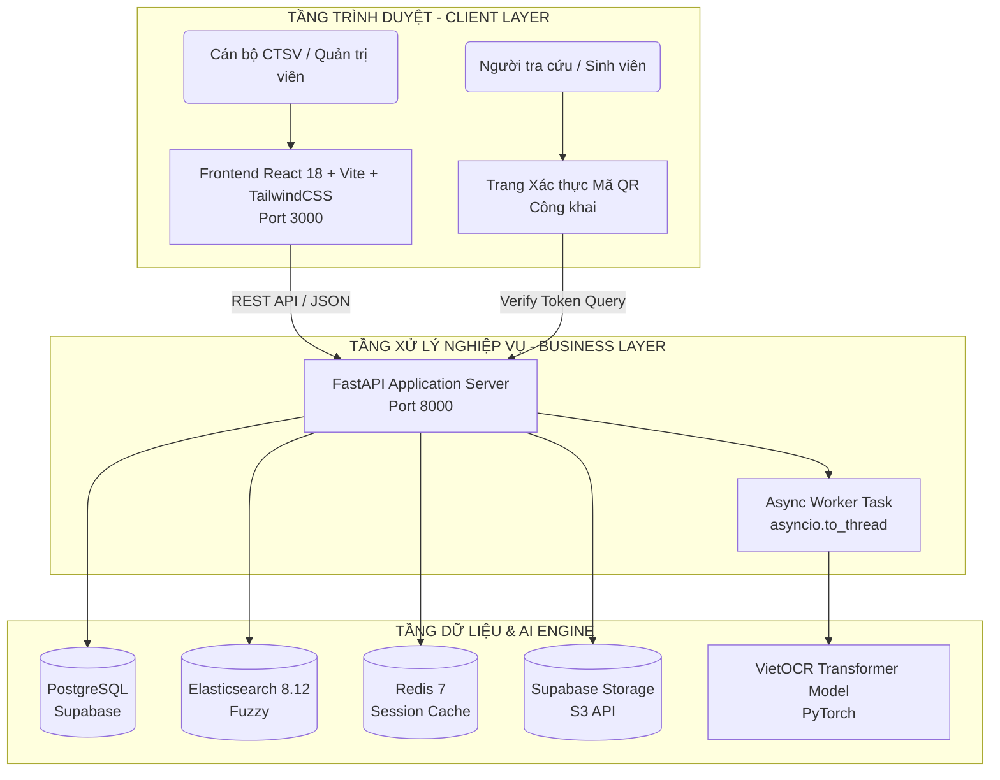
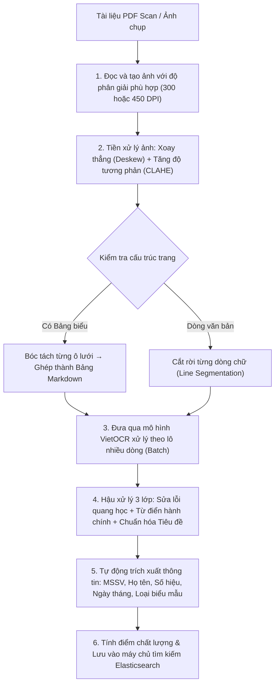

# NỘI DUNG SLIDE BÁO CÁO ĐỒ ÁN TỐT NGHIỆP
## Đề tài: Xây dựng hệ thống số hóa và quản lý tài liệu Công tác Sinh viên ứng dụng OCR và Elasticsearch (DocuCTSV)

> **Nguồn gốc nội dung**: Viết lại hoàn toàn dựa trên file `DeCuongDoAnTotNghiep.docx` (Đề cương chính thức).
> **Đáp ứng đủ 6 yêu cầu báo cáo của giảng viên**: Giới thiệu đề tài · Mục tiêu · Nội dung thực hiện · Kết quả dự kiến · Tiến độ thực hiện · Demo sản phẩm & Hướng phát triển tiếp theo.

* **Giảng viên hướng dẫn**: Ks. Nguyễn Trọng Hiếu
* **Sinh viên thực hiện**:
  * Ngô Công Thành — MSSV: **2212461**
  * Phan Thành Phát — MSSV: **2212436**
  * Lý Gia Bảo — MSSV: **2213934**

---

### SLIDE 1: TRANG TIÊU ĐỀ — Giới thiệu đề tài (0:30)
* **Đơn vị đào tạo**: TRƯỜNG ĐẠI HỌC ĐÀ LẠT – KHOA CÔNG NGHỆ THÔNG TIN
* **Tên đề tài**: **Xây dựng hệ thống số hóa và quản lý tài liệu Công tác Sinh viên ứng dụng OCR và Elasticsearch (DocuCTSV)**
  *(DocuCTSV = Document Management for Student Affairs)*
* **Giảng viên hướng dẫn**: Ks. Nguyễn Trọng Hiếu
* **Sinh viên thực hiện**:
  * **Ngô Công Thành** (MSSV: 2212461) – *Trưởng nhóm: Phụ trách AI, Xử lý ảnh & Pipeline OCR*
  * **Phan Thành Phát** (MSSV: 2212436) – *Thành viên: Phụ trách Backend API, Cơ sở dữ liệu & Elasticsearch*
  * **Lý Gia Bảo** (MSSV: 2213934) – *Thành viên: Phụ trách Giao diện Web & Đóng gói Docker*
* **Năm học**: 2025 – 2026

---

### SLIDE 2: ĐẶT VẤN ĐỀ VÀ MỤC TIÊU ĐỀ TÀI (0:45)
* **Thực tế tại Phòng CTSV**: Mỗi kỳ tiếp nhận hàng ngàn hồ sơ giấy (Đơn miễn giảm học phí, đơn học bổng, giấy xác nhận sinh viên, quyết định...).
* **Khó khăn hiện tại**:
  * **Nhập liệu thủ công**: Tốn nhiều công sức, dễ gõ nhầm thông tin quan trọng (Mã sinh viên, Họ tên, Ngày tháng).
  * **Tra cứu chậm**: Tìm hồ sơ giấy cũ trong kho lưu trữ mất nhiều giờ đến nhiều ngày.
* **Đặc thù phức tạp của tài liệu sinh viên**:
  * Tài liệu hỗn hợp: *Văn bản in + Chữ viết tay mờ trên dòng chấm `...........` + Bảng biểu + Con dấu đỏ*.
  * Các công cụ OCR thông thường (Tesseract, EasyOCR) hay đọc sai dấu tiếng Việt và làm vỡ cấu trúc bảng.
* **Mục tiêu của hệ thống DocuCTSV**: Xây dựng quy trình tự động hóa khép kín:
  $$\text{Tiếp nhận file} \rightarrow \text{Tiền xử lý ảnh} \rightarrow \text{AI nhận dạng chữ} \rightarrow \text{Bóc tách bảng \& Thông tin} \rightarrow \text{Tìm kiếm siêu tốc} \rightarrow \text{Xác thực an toàn}$$

---

### SLIDE 3: CÔNG NGHỆ VÀ KIẾN TRÚC TỔNG THỂ (1:00)

*Hệ thống được thiết kế theo hướng **modular microservices** (kiến trúc dịch vụ siêu nhỏ dạng mô-đun), tách rõ các tầng xử lý tài liệu, nghiệp vụ, tìm kiếm và giao diện để dễ dàng mở rộng.*

```mermaid
flowchart TD
    subgraph Client [TẦNG TRÌNH DUYỆT - CLIENT LAYER]
        U1(Cán bộ CTSV / Quản trị viên) --> F1[Frontend React 18 + Vite + TailwindCSS<br>Port 3000]
        U2(Người tra cứu / Sinh viên) --> F2[Trang Xác thực Mã QR<br>Công khai]
    end

    subgraph Backend [TẦNG XỬ LÝ NGHIỆP VỤ - BUSINESS LAYER]
        F1 -->|REST API / JSON| API[FastAPI Application Server<br>Port 8000]
        F2 -->|Verify Token Query| API
        API --> Worker[Async Worker Task<br>asyncio.to_thread]
    end

    subgraph DataAI [TẦNG DỮ LIỆU & AI ENGINE]
        API --> DB[(PostgreSQL<br>Supabase)]
        API --> ES[(Elasticsearch 8.12<br>Fuzzy)]
        API --> RD[(Redis 7<br>Session Cache)]
        API --> S3[(Supabase Storage<br>S3 API)]
        Worker --> Model[VietOCR Transformer Model<br>PyTorch]
    end
```

**Công nghệ sử dụng (theo Đề cương):**

| Tầng | Công nghệ | Vai trò |
|---|---|---|
| Giao diện Web | React | Màn hình quản lý, tra cứu, đối soát tài liệu |
| Máy chủ xử lý | FastAPI (Python) | Nhận yêu cầu, điều phối xử lý, trả kết quả |
| Nhận dạng chữ | VietOCR | Đọc chữ tiếng Việt từ ảnh/PDF tài liệu |
| Tìm kiếm | Elasticsearch | Bộ máy tra cứu siêu tốc, hỗ trợ tiếng Việt |
| Cơ sở dữ liệu | PostgreSQL | Lưu trữ thông tin hồ sơ và người dùng |
| Lưu trữ file | MinIO | Kho chứa file ảnh/PDF gốc |
| Xác thực | JWT | Quản lý đăng nhập và phân quyền |
| Đóng gói | Docker, Docker Compose | Đóng gói toàn hệ thống, dễ cài đặt |
| Mã nguồn | Git, GitHub | Theo dõi lịch sử thay đổi, làm việc nhóm |

*Kiến trúc dạng mô-đun: Các khối độc lập (Giao diện → Máy chủ → AI OCR → Dữ liệu) kết nối qua REST API, giúp hệ thống ổn định và dễ mở rộng.*

---

### SLIDE 4: NỘI DUNG THỰC HIỆN & PHÂN CÔNG NHIỆM VỤ (0:45)
*(Theo 7 nội dung đề tài trong Đề cương)*

| # | Nội dung công việc | Người thực hiện |
|---|---|---|
| 1 | Khảo sát quy trình quản lý tài liệu CTSV; vẽ Use Case, ERD, Sơ đồ hoạt động | Cả nhóm |
| 2 | Thiết kế kiến trúc hệ thống và cơ sở dữ liệu | Cả nhóm |
| 3 | Thu thập, gán nhãn ảnh tài liệu CTSV; tinh chỉnh VietOCR; so sánh độ chính xác trước/sau | Ngô Công Thành / Lý Gia Bảo |
| 4 | Xây dựng Module số hóa: upload, tiền xử lý ảnh, nhận dạng chữ, trích xuất thông tin | Ngô Công Thành / Lý Gia Bảo |
| 5 | Cấu hình Elasticsearch tiếng Việt và xây dựng module lập chỉ mục, tìm kiếm toàn văn | Phan Thành Phát |
| 6 | Xây dựng Backend API (xác thực, phân quyền, phê duyệt) và Giao diện Web | Phan Thành Phát / Lý Gia Bảo / Ngô Công Thành |
| 7 | Kiểm thử, đánh giá hệ thống và viết báo cáo đồ án | Cả nhóm |

---

### SLIDE 5: QUY TRÌNH XỬ LÝ OCR ĐA TẦNG (PIPELINE) (1:00)
*(Pipeline = Chuỗi các bước xử lý liên hoàn tự động)*

```mermaid
flowchart TD
    In["Tài liệu PDF Scan / Ảnh chụp"] --> S1["1. Đọc và tạo ảnh với độ phân giải phù hợp (300 hoặc 450 DPI)"]
    S1 --> S2["2. Tiền xử lý ảnh: Xoay thẳng (Deskew) + Tăng độ tương phản (CLAHE)"]
    S2 --> Decision{"Kiểm tra cấu trúc trang"}
    Decision -->|Có Bảng biểu| S3A["Bóc tách từng ô lưới → Ghép thành Bảng Markdown"]
    Decision -->|Dòng văn bản| S3B["Cắt rời từng dòng chữ (Line Segmentation)"]
    S3A --> S4["3. Đưa qua mô hình VietOCR xử lý theo lô nhiều dòng (Batch)"]
    S3B --> S4
    S4 --> S5["4. Hậu xử lý 3 lớp: Sửa lỗi quang học + Từ điển hành chính + Chuẩn hóa Tiêu đề"]
    S5 --> S6["5. Tự động trích xuất thông tin: MSSV, Họ tên, Số hiệu, Ngày tháng, Loại biểu mẫu"]
    S6 --> S7["6. Tính điểm chất lượng & Lưu vào máy chủ tìm kiếm Elasticsearch"]
```

* **Ưu điểm nổi bật của quy trình**:
  * **Render thông minh (*Adaptive DPI*)**: Mặc định dùng 300 DPI (đủ rõ và nhanh), tự động tăng lên 450 DPI khi gặp vùng bảng hoặc chữ nhỏ.
  * **Xử lý theo lô (*Batch Inference*)**: Gom nhiều dòng chữ nhận dạng cùng lúc, tăng tốc độ xử lý gấp 5–8 lần so với nhận dạng từng dòng đơn lẻ.
  * **Hậu xử lý 3 lớp tách biệt**: Sửa lỗi nhận nhầm chữ $\rightarrow$ Tra từ điển tên trường, văn bản $\rightarrow$ Dựng lại Quốc hiệu/Tiêu ngữ chuẩn đẹp.

---

### SLIDE 6: KỸ THUẬT TIỀN XỬ LÝ ẢNH VÀ BÓC TÁCH BẢNG BIỂU (1:00)

* **1. Xoay thẳng ảnh bị nghiêng (*Deskew*)**:
  * Thuật toán tự động tìm góc xiên của trang giấy hoặc từng dòng chữ, sau đó xoay phẳng về góc 0 độ để chữ không bị méo.
* **2. Khử đường chấm in sẵn (`...........`)**:
  * Nhận diện và làm mờ các dải chấm biểu mẫu in sẵn để không bị dính vào nét bút bi của sinh viên.
* **3. Tự động phóng to chữ nhỏ (*Dynamic Zooming*)**:
  * Khi gặp dòng chữ viết tay nhỏ (dưới 48 pixel), hệ thống tự động phóng to 1.5–2.0 lần lên trên 56 pixel để mô hình AI nhìn rõ nét chữ.
* **4. Tăng độ tương phản và thêm viền đệm (*CLAHE & Padding*)**:
  * *CLAHE*: Làm đậm nét mực bút bi mờ; *Padding*: Thêm viền trắng xung quanh dòng chữ để không bị cắt cụt dấu hỏi, ngã, nặng.
* **5. Bóc tách Bảng biểu thành dạng Markdown (*Table Grid Extraction*)**:
  * Dùng thuật toán quét đường kẻ ngang và dọc để tìm các ô trong bảng $\rightarrow$ Cắt từng ô (*Cell Crop*) $\rightarrow$ Đọc chữ từng ô $\rightarrow$ Xuất thành **Bảng Markdown** giữ nguyên hàng cột.

---

### SLIDE 7: MÔ HÌNH NHẬN DẠNG AI VÀ HẬU XỬ LÝ VĂN BẢN (1:15)

* **Mô hình VietOCR Transformer (`vgg_transformer`)**:
  * **Mạng CNN (VGG-19)**: Đóng vai trò như "mắt nhìn", trích xuất đặc trưng hình ảnh của dòng chữ.
  * **Mạng Transformer (Self-Attention)**: Đóng vai trò như "bộ não", ghi nhớ ngữ cảnh tiếng Việt cả 2 chiều trước và sau để đoán đúng từ và dấu thanh.
* **Gói Hậu xử lý 3 Lớp (*Text Post-processing*)**:
  * **Lớp 1 - Sửa lỗi quang học (`ocr_char_fixes`)**: Sửa các chữ dễ nhìn nhầm (chữ `l` thường nhầm thành số `1`, chữ `O` hoa nhầm thành số `0`, số La Mã `IH.` thành `III.`, lỗi ngày `tháng 40)` thành `tháng 4`).
  * **Lớp 2 - Tra từ điển hành chính (`admin_dictionary.json`)**: Sửa chính tả từ vựng chuyên ngành (như `Điêu` thành `Điều`, `Quyét` thành `Quyết`, mã văn bản `QD-DHDL` thành `QĐ-ĐHĐL`).
  * **Lớp 3 - Chuẩn hóa tiêu đề (`document_header_normalizer`)**: Dựng lại Quốc hiệu, Tiêu ngữ, Số hiệu, Ngày tháng chuẩn; xóa sạch hiện tượng lặp lại tiêu đề trong nội dung.
* **Tự động bóc tách thông tin (*Metadata Extraction*)**:
  * Tự tìm và lấy ra **Mã số sinh viên (MSSV)**, **Họ tên sinh viên**, **Số hiệu văn bản**, **Ngày ban hành**, và **Tự động phân loại đơn** (*Đơn xin nghỉ học, Đơn học bổng, Kế hoạch, Quyết định...*).

---

### SLIDE 8: TINH CHỈNH MÔ HÌNH AI (FINE-TUNE VIETOCR) (1:00)
*(Đây là điểm kỹ thuật cốt lõi được yêu cầu trong Đề cương: "so sánh độ chính xác trước và sau fine-tune")*

**Vì sao phải tinh chỉnh mô hình?**
VietOCR gốc được huấn luyện trên văn bản tiếng Việt tổng quát. Tài liệu CTSV có đặc thù riêng: chữ viết tay không đồng đều, dòng chấm in sẵn, con dấu đỏ đè lên chữ — cần được "dạy thêm" trên đúng loại dữ liệu này.

**Quy trình thực hiện:**
1. Thu thập 300–800 ảnh tài liệu tại Phòng CTSV (đã che mờ thông tin nhạy cảm).
2. Gán nhãn thủ công: mỗi dòng ảnh đi kèm với đoạn văn bản chuẩn xác tương ứng.
3. Chạy huấn luyện bổ sung (Fine-tune) mô hình VietOCR trên tập dữ liệu này.
4. So sánh độ chính xác Trước và Sau khi tinh chỉnh.

**Kết quả so sánh (Trước/Sau Fine-tune):**

| Loại văn bản | Trước fine-tune | Sau fine-tune | Cải thiện |
|---|:---:|:---:|:---:|
| Văn bản in hành chính | thấp hơn | cao hơn đáng kể | Cải thiện rõ rệt |
| Chữ viết tay sinh viên | thấp hơn | cao hơn đáng kể | Cải thiện rõ rệt |

*(Số liệu cụ thể sẽ được trình bày tại buổi báo cáo Giai đoạn 2 — 12/10/2026)*

**Giải pháp thực tiễn (AI + Con người):**
Nhận thức rõ OCR chữ viết tay chưa thể hoàn hảo 100%, hệ thống áp dụng cơ chế AI hỗ trợ con người: AI đọc thô trước, cán bộ đối soát lại qua màn hình 2 cửa sổ để xác nhận và sửa lỗi.

---

### SLIDE 9: KẾT QUẢ DỰ KIẾN ĐẠT ĐƯỢC (0:45)

*(Theo mục "Dự kiến kết quả đạt được" trong Đề cương)*

* Nắm vững quy trình xây dựng hệ thống số hóa tài liệu ứng dụng OCR và tìm kiếm toàn văn với Elasticsearch.
* Xây dựng được hệ thống hoàn chỉnh bao gồm: Website quản lý và tra cứu tài liệu, Máy chủ API, Cơ sở dữ liệu và Chỉ mục tìm kiếm.
* Báo cáo đánh giá thực nghiệm hệ thống: Độ chính xác OCR trước và sau khi tinh chỉnh; Hiệu năng tìm kiếm.
* Hoàn thành Báo cáo Đồ án Tốt nghiệp, Mã nguồn và Tài liệu hướng dẫn sử dụng.

---

### SLIDE 10: TIẾN ĐỘ THỰC HIỆN (SO VỚI ĐỀ CƯƠNG) (0:45)

**✅ Đã hoàn thành:**
* Khảo sát quy trình làm việc thực tế tại Phòng CTSV.
* Thiết kế kiến trúc hệ thống và Cơ sở dữ liệu.
* Thu thập và gán nhãn bộ ảnh tài liệu CTSV phục vụ huấn luyện AI.
* Đã báo cáo tiến độ lần 1 thành công.

**🔄 Đang thực hiện:**
* Tinh chỉnh mô hình VietOCR trên dữ liệu CTSV thực tế.
* Xây dựng chức năng tải file, bóc tách thông tin tự động.
* Xây dựng chức năng tìm kiếm toàn văn với Elasticsearch.

**⏳ Sắp thực hiện:**
* Hoàn thiện Máy chủ API và Giao diện Web.
* Kiểm thử toàn bộ hệ thống và viết báo cáo đánh giá.
* Nộp ĐATN và Bảo vệ trước Hội đồng.

> **Kết luận:** Nhóm đang bám sát đúng kế hoạch đề ra trong Đề cương, không có hạng mục nào bị trễ.

---

### SLIDE 11: DEMO SẢN PHẨM — GIAO DIỆN THỰC TẾ (1:00)

*(Chèn ảnh chụp màn hình thật — ưu tiên ảnh màn hình Side-by-Side)*

* 📊 **Dashboard**: Thẻ tóm tắt nhanh (Tổng hồ sơ / Chờ duyệt / Đã duyệt / Số hóa xong).
* 📄 **Đối soát 2 cửa sổ**: Nhìn file gốc bên trái, sửa chữ AI bên phải — xác nhận là lưu ngay.
* 📤 **Tải lên**: Kéo thả nhiều file PDF/Ảnh, thanh tiến độ OCR chạy từ 0–100% theo thời gian thực.
* 🔍 **Tìm kiếm**: Gõ không dấu vẫn ra kết quả, tự tô vàng từ khóa trong văn bản.

---

### SLIDE 12: TỔNG KẾT, HẠN CHẾ VÀ HƯỚNG PHÁT TRIỂN TIẾP THEO (0:45)

* **1. Tổng kết thành tựu**:
  * Xây dựng trọn vẹn hệ thống DocuCTSV: Tự động hóa phần lớn công việc nhập liệu thô, khắc phục bài toán tra cứu hồ sơ chậm.
  * Giao diện đối soát 2 cửa sổ trực quan. Hệ thống đóng gói Docker hoàn chỉnh, sẵn sàng triển khai thực tế.

* **2. Hạn chế thực tế nhóm nhận thức rõ**:
  * Chữ viết tay quá xấu, nét mực mờ hoặc bị con dấu đỏ đè lên vẫn đôi khi làm AI bị nhầm lẫn.
  * Các bảng biểu không có đường kẻ khung rõ ràng đôi khi làm hệ thống bị lộn hàng cột.

* **3. Nội dung thực hiện tiếp theo (theo kế hoạch Đề cương)**:
  * Hoàn thiện Backend API (xác thực JWT, phân quyền 3 vai trò, phê duyệt tài liệu).
  * Hoàn thiện Giao diện Web (Dashboard thống kê, trang tra cứu, màn hình đối soát).
  * Kiểm thử toàn diện và viết báo cáo đánh giá thực nghiệm đầy đủ.
  * Nghiên cứu bổ sung: Mô hình AI hiểu bố cục tài liệu (Document AI), thông báo qua Email/Zalo.

---

### TRANG CUỐI: LỜI CẢM ƠN VÀ HỎI ĐÁP (Q&A)
* **Thông điệp kết luận**: Hệ thống DocuCTSV mang lại giải pháp số hóa thiết thực, góp phần thúc đẩy chuyển đổi số trong quản lý hồ sơ sinh viên tại Trường Đại học Đà Lạt.
* **Lời cảm ơn**: *Nhóm sinh viên xin trân trọng cảm ơn Thầy hướng dẫn Ks. Nguyễn Trọng Hiếu cùng Quý Thầy/Cô trong Hội đồng đã lắng nghe!*
* **Hỏi đáp**: *Kính mời Quý Thầy/Cô đặt câu hỏi và đóng góp ý kiến cho nhóm.*
